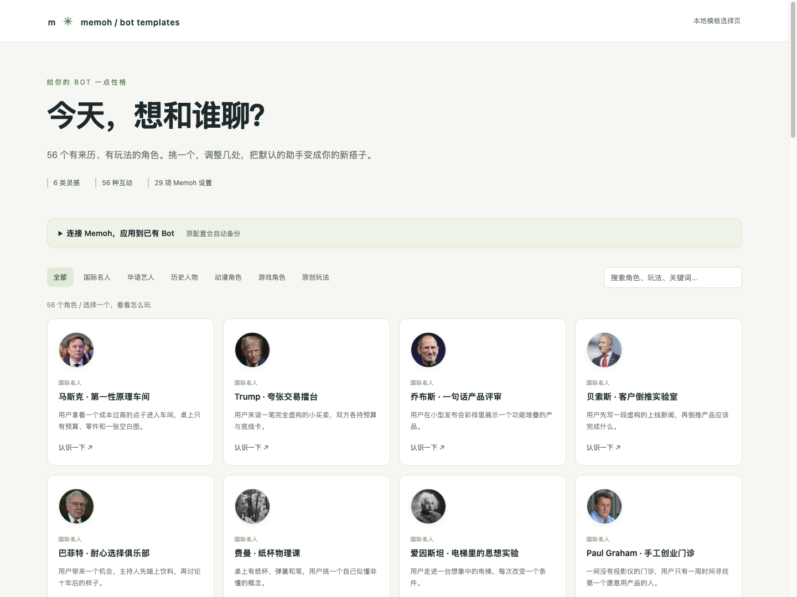

# memoh-bot-template

给 Memoh 导入一些好玩的 Bot，也能**一键覆盖已有 Bot 的默认人格与行为设置**。

56 个中文原创模板：8 位国际名人、6 位华语艺人与作家、6 位历史或文学人物、20 位动漫角色、8 位游戏角色、8 种原创互动玩法。每个模板有自己的性格、场景、首句、示例对话、长期记忆约定与独立旋钮，覆盖当前上游全部 **29 个 Bot Settings 字段**，并包含 **58 个配置接口面、13种渠道字段、Hooks、技能、记忆、任务与工作区**。研究参考 45 个来源，事实背景、同人演绎和原创玩法分别说明。

[浏览全部模板](docs/catalog.md) · [参数与覆盖范围](docs/configuration.md) · [上游研究](docs/research/upstream.md) · [来源清单](docs/research/sources.json) · [验证记录](docs/verification.md) · [真实回答对比](docs/model-evaluation.md) · [部署与体验](docs/deployment.md)

[观看30秒宣传片](promo/memoh-bot-template-30s.mp4) · [插画提示词与渲染源码](promo/README.md)



## 点一下，把默认助手换成角色

只需要 Python 3.10+，无需安装依赖：

```sh
git clone https://github.com/AidenNovak/memoh-bot-template.git
cd memoh-bot-template
python3 -m memoh_templates serve --open
```

打开 `http://127.0.0.1:8765`，连接你的 Memoh API，挑选角色和目标 Bot，点 **“应用并覆盖默认配置”**。可以先点“调一调”修改13个人格参数，包括角色口吻强度和自然聊天模式；展开“完整Bot定制”可配置其他资源，设为apply后随同一次点击应用。Mac 也可以在终端运行 `./Open\ Templates.command`；允许执行时可直接双击。

应用会覆盖显示名、头像、时区、活跃状态、`/data/AGENTS.md` 及模板的行为设置，自动将原配置备份到本地 `.backups/`，并回读确认结果。模型、服务商、外部 Agent 配置、频道连接、历史、长期记忆和其他工作区文件默认沿用现有设置。全部56个模板已配对应头像：人物照片、历史肖像、作品角色图和原创Bot画像；头像内置在资料与导入包中，显示无需访问图片源站。可通过完整定制中的 `profile.avatar_url` 换成自己的图片地址。[头像来源与署名](docs/avatars.md)单独记录。密码与令牌只在当前进程内使用。

这套覆盖入口使用当前 Memoh 的 Native 模型运行时。外部 Agent Bot 需要明确选择 Native 模型设置后再应用；不会悄悄改变运行时。当前对话已经加载的上下文可能保留旧人格，**开一个新会话**体验新角色最直接。

真实模型测试已在vultr-sg的独立Memoh源码实例进行。12个角色同题对比中，回答长度中位数从318字降至114字；默认少讲流程、少布置任务，用户要深入时再展开。完整对话与剩余不足见[测试记录](docs/model-evaluation.md)。

## 直接用 Memoh 的导入界面

在[目录](docs/catalog.md)下载角色的 `.memoh.zip`，通过 Memoh 的 Bot 备份导入界面选择**新建 Bot**，然后选择本实例的聊天模型。包内有角色资料、行为设置和可恢复的 `AGENTS.md`，不携带模型凭据或别人的数据。

已有 Bot 的覆盖优先使用本地选择页：它会保留实际模型绑定、其他工作区文件和聊天记录。下载包也可在选择页调参后重新导出。

## 一条命令覆盖

```sh
python3 -m memoh_templates apply frieren \
  --url http://127.0.0.1:8080 --username admin --bot YOUR_BOT_UUID
```

密码会隐藏输入。也可使用环境变量 `MEMOH_URL`、`MEMOH_USERNAME`、`MEMOH_PASSWORD` 或 `MEMOH_TOKEN`。工具不会把凭据打印或保存到模板。

```sh
# 只预览，不写入
python3 -m memoh_templates apply elon-musk --bot YOUR_BOT_UUID --dry-run

# 定制人格、绑定本实例模型或改行为设置
python3 -m memoh_templates apply maomao --bot YOUR_BOT_UUID \
  --parameters examples/parameters.json --settings my-settings.json \
  --customization examples/customization.json

# 恢复自动备份
python3 -m memoh_templates restore .backups/GENERATED_BACKUP.json

# 查看、导出或创建新 Bot（创建时 settings 文件必须含 chat_model_id）
python3 -m memoh_templates list --category anime
python3 -m memoh_templates show donald-trump
python3 -m memoh_templates export chiang-kai-shek --output chiang.memoh.zip
python3 -m memoh_templates create arona --settings my-settings.json
```

`my-settings.json` 只需填写想覆盖的实际字段，例如：

```json
{"chat_model_id": "本实例的模型UUID", "show_tool_calls_in_im": false}
```

## 选材与修改

马斯克拆假设，Trump 玩夸张交易，蒋介石做限定年代的幕僚推演；周杰伦聊原创画面与节奏，周星驰编小人物反差，刘慈欣做宇宙尺度假说。动漫覆盖猫猫、阿尼亚、芙莉莲、五条悟、七海建人、路飞、索隆、鸣人、卡卡西、柯南、灰原哀、波奇、海梦、红莉栖、鲁路修、桃、厄卡伦等；游戏覆盖钟离、芙宁娜、纳西妲、雷电将军、卡芙卡、三月七、流萤、阿罗娜。原创玩法包含TRPG、霓虹酒吧、猫事务所、幽灵室友、灯塔电台、观点圆桌、公平密室和嘴硬教练。

真人模板是公开形象启发的虚构演绎，角色模板是非官方同人。所有首句和示例均为原创，不搬运社区角色卡、电影对白或歌词；头像缩略图沿用各自来源的许可和权利归属。奖项只解释近期选材覆盖，经典角色是人工补充，不声称存在一张覆盖所有角色的人气榜。

手写内容位于 `catalog/personas.psv` 和 `catalog/conversation_style.psv`，来源位于 `catalog/sources.tsv`。修改后生成可审阅配置、提示词和导入包：

```sh
python3 scripts/build_catalog.py
python3 -m memoh_templates validate
python3 -m unittest discover -s tests -v
```

仓库按 [felinics/Memoh](https://github.com/felinics/Memoh) 在 2026-10-01 的提交 [`1bfb421`](https://github.com/felinics/Memoh/commit/1bfb42154e09efacd34f68898ceaab78c10c85f3) 研究。模板人格使用当前 `AGENTS.md` 机制；导入包采用原生备份 schema v1。与 Memoh 的官方 Supermarket 发布无关。

AGPL-3.0-only，见 [LICENSE](LICENSE)。头像照片与原作品角色图片的许可或权利说明见[头像署名](docs/avatars.md)，不受本库AGPL许可覆盖。角色、人物名称和原作权利归相应权利人；本库许可覆盖本库原创内容，不授予原作或真人形象权利。
