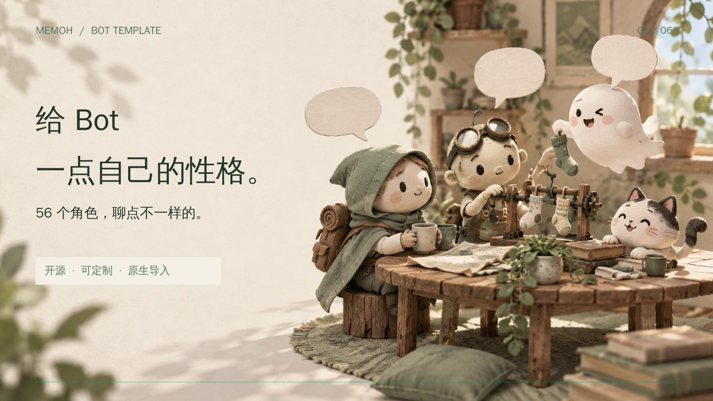

# 30秒宣传片

[下载或播放MP4](memoh-bot-template-30s.mp4) · [封面](poster.png) · [六镜头预览](storyboard.png) · [编码报告](render-report.json)



影片从原创角色插画进入实际模板选择页，展示角色、13个人格参数、一键应用和真实Memoh聊天，再介绍完整配置与开源地址。规格为1280×720、30fps、H.264/AAC，MP4支持faststart。

两张插画由内置 **image_gen** 生成，完整最终提示词和参考关系位于[prompts.md](prompts.md)，素材保存在 `assets/hero.png` 和 `assets/closing.png`。插画中的小旅行者、发明家、纸幽灵和猫是原创吉祥物。实际界面截图来自 `verification/`，2026-10-02更新为各Bot的独立头像；界面中的照片与作品角色图沿用[各自来源和权利归属](../docs/avatars.md)。对话引用来源记录见[evidence.json](evidence.json)。

音乐由渲染脚本用波形与和弦写成原创轻柔琶音，无外部录音、歌词或人物声音。镜头布局、文字动画、缩放、转场、音轨与编码均由[Python/FFmpeg脚本](../scripts/render_promo.py)生成。

## 重新渲染

在有FFmpeg和中文字体的Linux构建机执行，不需要安装Python依赖：

```sh
systemd-run --scope -p CPUQuota=400% -p MemoryMax=6G \
  python3 scripts/render_promo.py
```

默认字体 `/usr/share/fonts/truetype/wqy/wqy-zenhei.ttc`，可用 `MEMOH_PROMO_FONT` 指定替代字体。中间视频、文字文件与WAV写到被忽略的 `promo/.render/`。本次渲染在vultr-sg顺序完成，未在Mac运行视频编码。

本库原创插画、音乐、代码及剪辑遵循仓库许可；人物和作品角色名称仍归相应权利人。宣传片没有声称官方授权或各模型均能得到相同回答。
