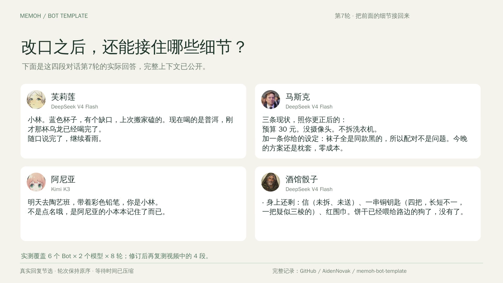

# 多轮真实回复宣传片

[播放或下载两分钟MP4](memoh-bot-template-multiturn-120s.mp4) · [封面](multiturn-poster.png) · [六镜头预览](multiturn-storyboard.png) · [编码报告](multiturn-render-report.json) · [完整多轮评估](../docs/multiturn-evaluation.md)



新版影片把主要篇幅留给对话：芙莉莲、马斯克、阿尼亚和TRPG各展示连续第4—7轮，16条来自真实Memoh运行时的回复节选。开场、改口、岔开话题后的反应和第7轮回忆放在一起，能直接看到茶从乌龙换成普洱、预算从80元降到30元、画画班换成陶艺班，以及饼干已喂狗、信尚未送出。

影片也保留失误：马斯克给焦面包起名字时接回袜子，画面标注“笑话接偏了一次”。TRPG的完整回答会擅自补玩家动作，阿尼亚仍偶有成人安慰口吻；原始DeepSeek批次另有两条工具标签泄露。这些都见[完整评估](../docs/multiturn-evaluation.md)，没有用成功复测替换原始失败记录。

影片为1920×1080、30fps、120秒、H.264/AAC，支持faststart。聊天正文35px，大号用户气泡、头像、实际模型名与轮次同时出现。每段右侧逐轮更新并保留上一轮，左侧展示第1轮用户原文与同一段原生Memoh界面的截图。影片是排版后的实测样例，等待时间压缩；“节选”标签与全部八轮原文均可核对。

| 时间 | 内容 |
| --- | --- |
| 00:00—00:06 | 四个Bot的真实回复预览 |
| 00:06—00:30 | 芙莉莲 / DeepSeek，连续第4—7轮 |
| 00:30—00:54 | 马斯克 / DeepSeek，连续第4—7轮 |
| 00:54—01:18 | 阿尼亚 / Kimi，连续第4—7轮 |
| 01:18—01:42 | TRPG / DeepSeek，连续第4—7轮 |
| 01:42—01:52 | 四段第7轮回复并排回看 |
| 01:52—02:00 | 模板导入与开源地址 |

## 原文与素材

原始试验为6个Bot×2个模型×8轮、96条回答；模板补充当前会话与普通闲聊工具边界后，复测影片中的4段、32条回答。影片使用[复测记录](../verification/model-replies/multiturn-followup.json)，每段保持同一个会话、默认参数，不另造用于宣传的对白。

[剪辑索引](multiturn-selection.json)记录每个节选在原始回复里的起止字符、原文和整份记录的SHA-256。长回复优先取80字以内的连续开头；TRPG库存信息取回答中对应的完整连续段落或一行。视觉排版省略Markdown加粗标记与空白行；没有重写句子、拼接不同轮次，或剪掉同一条回复中的工具标签来伪装成功。页首小卡片还会缩短同一节选的连续开头，标为“第7轮节选”。

[原生网页回读](../verification/multiturn-ui.json)在截图前逐句核对8对持久化消息，不发送新消息。所有临时Bot在截图后删除，已有四个演示Bot保留。自动测试会检查完整记录、节选与原生截图的对应关系，篡改、跳轮、会话变更和未完成运行都会被拒绝。

两张插画复用此前内置 **image_gen** 生成的原创作品，[完整提示词](prompts.md)与`assets/hero.png`、`assets/closing.png`仍保留。小旅行者、发明家、纸幽灵和猫是原创吉祥物。Bot头像沿用[逐图来源与权利归属](../docs/avatars.md)。音乐由代码生成原创轻柔琶音，无外部录音、歌词或人物声音。

## 重新渲染

Python标准库、FFmpeg/librsvg与WenQuanYi Zen Hei中文字体即可，所有编码在Linux构建机顺序执行：

```sh
python3 scripts/build_multiturn_promo.py
systemd-run --scope -p CPUQuota=400% -p MemoryMax=6G \
  python3 scripts/render_multiturn_promo.py --preview-only
# 检查预览帧后再编码
systemd-run --scope -p CPUQuota=400% -p MemoryMax=6G \
  python3 scripts/render_multiturn_promo.py
ffmpeg -v error -i promo/memoh-bot-template-multiturn-120s.mp4 -f null -
```

[节选生成器](../scripts/build_multiturn_promo.py)与[SVG/FFmpeg渲染脚本](../scripts/render_multiturn_promo.py)均在仓库内。中间SVG、19张1080p预览、镜头视频与音轨保存在被忽略的`promo/.render-multiturn/`，渲染前验证来源散列与每个原文字段。本次在vultr-sg受限任务完成，Mac只做编辑与界面截图。

早期[30秒功能介绍](memoh-bot-template-30s.mp4)、[封面](poster.png)、[分镜](storyboard.png)、[来源](evidence.json)与[渲染脚本](../scripts/render_promo.py)继续保留，主要介绍选择页、13个人格参数、一键应用和完整配置。

本库原创插画、音乐、代码与剪辑遵循仓库许可；照片与作品角色图片沿用各自许可或权利归属。角色均为模板演绎，非本人或官方服务；影片不声称各模型都能产生相同回答。
